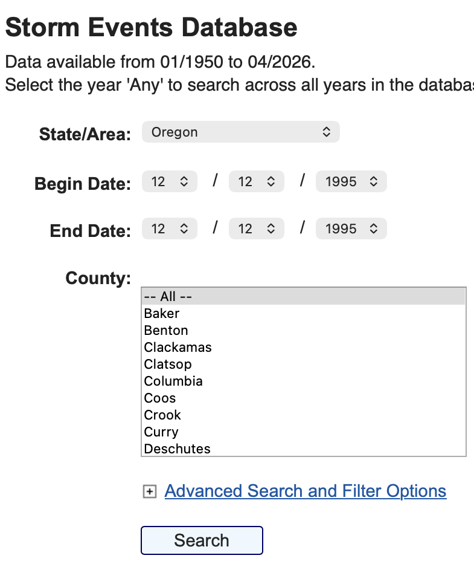
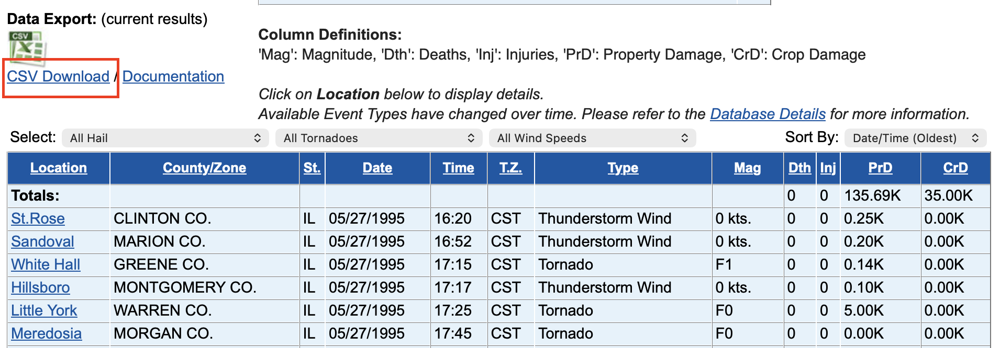

## Introduction
In the study of economic impact of various events, the property damage and crop damage are defined by 4 fields:  
- PROPDMG  
- PROPDMGEXP  
- CROPDMG  
- CROPDMGEXP  

Where PROPDMG and CROPDMG provide the coefficient, while PROPDMGEXP and CROPDMGEXP define the exponent of the coefficients.

However, since there is some ambiguity with the EXP entries, this report is to illustrate the interpretation of the values.


<br>
## Possible Entries in both EXP fields:  

``` r
    sort(unique(c(data$PROPDMGEXP, data$CROPDMGEXP)))
```

```
##  [1] ""  "-" "?" "+" "0" "1" "2" "3" "4" "5" "6" "7" "8" "B" "h" "H" "k" "K" "m" "M"
```
  
The entries below are trivial:  
"h" "H": Hundred  
"k" "K": Thousand  
"m" "M": Million  
"B": Billion  
  
The entries below are of conern:  
""  "-" "?" "+" "0" "1" "2" "3" "4" "5" "6" "7" "8"  
<br>

## Entries Analysis
The analysis is done by comparing the zip data with the data published in **[NOAA Website](https://www.ncei.noaa.gov/stormevents/)**.
During sample check, the search criteria is defined by STATE and BGN_TIME.  
   

The corresponding event is confirmed by comparing BGN_TIME with the Start Time of the webpage result.
<br><br>


#### Entries '-', '?':

``` r
    partition <- arrange(subset(extract, PROPDMGEXP == '-' | CROPDMGEXP == '-'), STATE)
    kable(partition, row.names = FALSE)
```


|BGN_DATE           |BGN_TIME |BGN_LOCATI |COUNTYNAME                 |STATE |EVTYPE    | PROPDMG|PROPDMGEXP | CROPDMG|CROPDMGEXP |
|:------------------|:--------|:----------|:--------------------------|:-----|:---------|-------:|:----------|-------:|:----------|
|12/12/1995 0:00:00 |1000     |           |ORZ004 - 05 - 06 - 08 - 09 |OR    |HIGH WIND |      15|-          |       0|           |

The event is not found in the webpage, and thus neglected.
<br>


``` r
    extract_prop <- select(extract, -CROPDMG, -CROPDMGEXP)
    partition <- arrange(subset(extract_prop, PROPDMGEXP == '?'), STATE)
    kable(partition, row.names = FALSE)
```


|BGN_DATE          |BGN_TIME |BGN_LOCATI |COUNTYNAME |STATE |EVTYPE             | PROPDMG|PROPDMGEXP |
|:-----------------|:--------|:----------|:----------|:-----|:------------------|-------:|:----------|
|4/9/1995 0:00:00  |2320     |Galva      |HENRY      |IL    |THUNDERSTORM WINDS |       0|?          |
|5/8/1993 0:00:00  |1645     |Countywide |CREEK      |OK    |FLASH FLOOD        |       0|?          |
|5/8/1993 0:00:00  |1730     |Countywide |NOWATA     |OK    |FLASH FLOOD        |       0|?          |
|8/5/1994 0:00:00  |1607     |           |DARLINGTON |SC    |THUNDERSTORM WIND  |       0|?          |
|9/2/1995 0:00:00  |0800     |Hurley     |YANKTON    |SD    |HAIL               |       0|?          |
|9/2/1995 0:00:00  |0825     |Irene      |YANKTON    |SD    |HAIL               |       0|?          |
|9/2/1995 0:00:00  |0850     |Gayville   |YANKTON    |SD    |HAIL               |       0|?          |
|7/13/1995 0:00:00 |0630     |Hayward    |SAWYER     |WI    |THUNDERSTORM WINDS |       0|?          |

``` r
    extract_crop <- select(extract, -PROPDMG, -PROPDMGEXP)
    partition <- arrange(subset(extract_crop, CROPDMGEXP == '?'), STATE)
    kable(partition, row.names = FALSE)
```


|BGN_DATE          |BGN_TIME |BGN_LOCATI        |COUNTYNAME      |STATE |EVTYPE             | CROPDMG|CROPDMGEXP |
|:-----------------|:--------|:-----------------|:---------------|:-----|:------------------|-------:|:----------|
|3/9/1995 0:00:00  |0301     |                  |MARIN           |CA    |FLASH FLOOD WINDS  |       0|?          |
|2/12/1993 0:00:00 |0100     |Barnesville       |LAMAR           |GA    |THUNDERSTORM WINDS |       0|?          |
|2/12/1993 0:00:00 |0000     |Columbus          |MUSCOGEE        |GA    |THUNDERSTORM WINDS |       0|?          |
|7/31/1995 0:00:00 |1450     |White Oak         |BLADEN          |NC    |THUNDERSTORM WINDS |       0|?          |
|2/16/1995 0:00:00 |0600     |Swain/Haywood     |NCZ001>002 - 18 |NC    |FLOOD/FLASH FLOOD  |       0|?          |
|8/26/1995 0:00:00 |2215     |Greer and Cowpens |SPARTANBURG     |SC    |FLOOD/FLASH FLOOD  |       0|?          |
|4/17/1995 0:00:00 |2106     |Laredo            |WEBB            |TX    |THUNDERSTORM WINDS |       0|?          |

For all events, the coefficients are all zeros and thus neglected.
<br><br>

#### Entries '', '+':
Items checked: <br>
6/5/1995 NV for '+'; 7/15/1995 NY for '' <br>

``` r
    partition <- subset(extract_prop, PROPDMGEXP %in% c('','+') & PROPDMG > 10 & 
                            ((STATE == 'NV' & BGN_DATE == '6/5/1995 0:00:00') | (STATE == 'NY' & BGN_DATE == '7/15/1995 0:00:00')) )
    kable(partition, row.names = FALSE)
```


|BGN_DATE          |BGN_TIME |BGN_LOCATI      |COUNTYNAME         |STATE |EVTYPE             | PROPDMG|PROPDMGEXP |
|:-----------------|:--------|:---------------|:------------------|:-----|:------------------|-------:|:----------|
|6/5/1995 0:00:00  |1304     |Extreme Western |NVZ003 - 004 - 007 |NV    |TORNADO            |      60|+          |
|7/15/1995 0:00:00 |0630     |Red Hook        |DUTCHESS           |NY    |THUNDERSTORM WINDS |      20|           |

The values for NV and NY in the website are 0.06K and 0.02K respectively.<br>
The results showed the '' and '+' are treating as exponent of 1.<br><br>

#### Entries '0'...'8':
Since the figures need to validate up to unit place, the csv file is required. The csv file is saved as 'web_csv'.<br>
   

``` r
    partition <- subset(extract_prop, PROPDMGEXP %in% c('5','6') & STATE == 'IL')
    partition$BGN_TIME <- as.numeric(partition$BGN_TIME)
    partition <- arrange(partition, desc(PROPDMGEXP))
    
    web_csv <- read.csv('web_csv.csv')
    web_csv$CZ_NAME_STR <- gsub(' CO.', '', web_csv$CZ_NAME_STR)
    
    db <- inner_join(partition, web_csv, by = c('COUNTYNAME' = 'CZ_NAME_STR', 'BGN_TIME' = 'BEGIN_TIME'))
    db <- db[,c('BGN_DATE',	'BGN_TIME',	'BGN_LOCATI', 'COUNTYNAME',	'STATE', 'EVTYPE', 'PROPDMG', 'PROPDMGEXP', 'DAMAGE_PROPERTY_NUM')]
    db <- rename(db, WEBPAGE_FIG = DAMAGE_PROPERTY_NUM)
    
    kable(db, rows.names = FALSE)
```


|BGN_DATE          | BGN_TIME|BGN_LOCATI |COUNTYNAME |STATE |EVTYPE             | PROPDMG|PROPDMGEXP | WEBPAGE_FIG|
|:-----------------|--------:|:----------|:----------|:-----|:------------------|-------:|:----------|-----------:|
|5/27/1995 0:00:00 |     1620|St.Rose    |CLINTON    |IL    |THUNDERSTORM WINDS |      24|6          |         246|
|5/27/1995 0:00:00 |     1715|White Hall |GREENE     |IL    |TORNADO            |      14|5          |         145|

The table demonstrates that when EXP entries are numeric, the exact figure should be calculated as:<br>

#### coefficient * 10 + exponent
